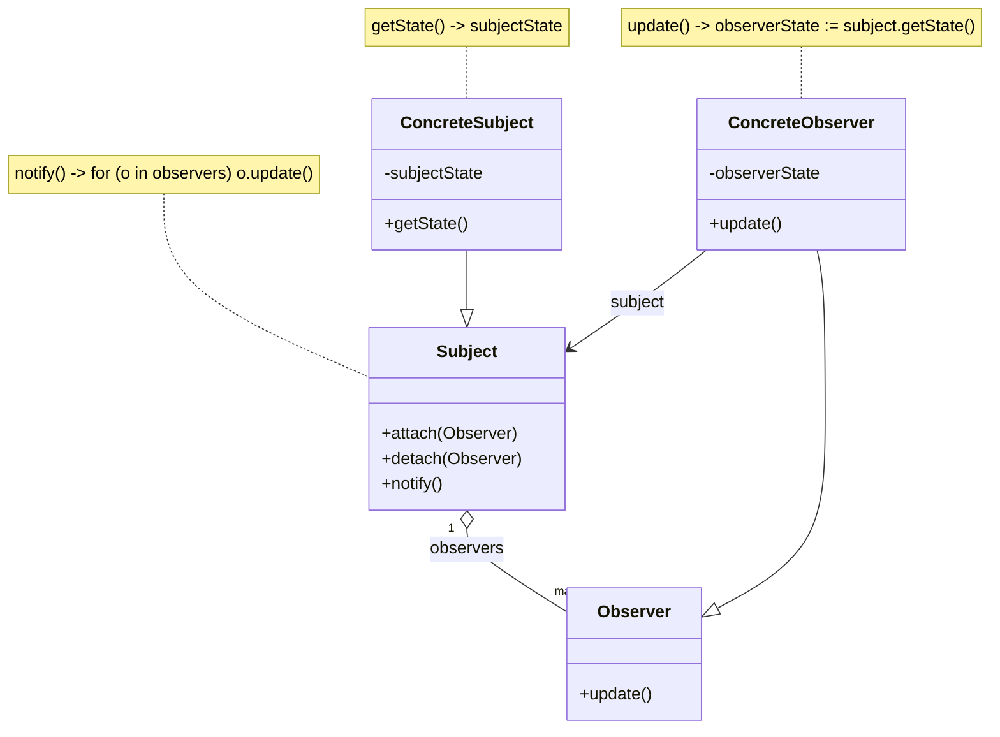

# Design Patterns as Language Constructs

Simon Walker  
June 26th, 2025

---
### What is good code?
## Washing Behind Your Ears: Principles of Software Hygiene
David M. Tilbrook: contributor of `QED` to unix, `vi` ancestor. And John McMullen

> Like personal hygiene, **software hygiene** is most conspicuous in its absence.

 Often, quality considers only the development phase; the real picture is wider. The side of profession not usually highlighted in programming courses, is maintenance. It is widely **estimated that 70% of the cost of software is devoted to maintenance.** No discussion of software quality can be satisfactory if it neglects this aspect.

**How can we?**
1. know when it's high quality
2. actually make it high quality

<!-- .slide: data-auto-animate -->

--
<!-- .slide: data-auto-animate -->
### What is good code?
## criteria for judging *quality*
1. **Extendibility** ease the modification of existing source and the addition or removal of source
2. **Reusability** promote and facilitate the sharing (i.e., reusability) of software components
3. **Compatibility** integrate diverse components in large systems
4. **Portability** operate agnostic to the specific system
5. **Testability** verify correctness before changes reach the product  

which all relate to **maintainability**

---

when the codebase gets large in a language like Java,
## The problem with design patterns
<!-- .slide: data-auto-animate -->

--
<!-- .slide: data-auto-animate -->
## The problem with design patterns
##### Design patterns have proven to be very useful,
~ for the design of object-oriented systems. The power of design patterns stems from their ability to provide generic solutions to reappearing problems that can be specialised for particular situations
##### but,
<!-- .slide: data-auto-animate -->

--
<!-- .slide: data-auto-animate -->
## The problem with design patterns
1. The traceability of a design pattern in the implementation is often insufficient; often the design pattern is "lost".   
2. Since several patterns require an object to forward messages to other objects to increase flexibility, the self problem often occurs. 
3. The pattern implementation is mixed with the domain class, the reusability of pattern implementations is often limited.
4. Implementing design patterns can present significant implementation overhead for the software engineer.

note:

1. Traceability: The traceability of a design pattern is often lost because the programming language does not support a corresponding concept. The software engineer is thus required to implement the pattern as distributed methods and message exchanges, i.e. the pattern which is a conceptual entity at the design level is scattered over different parts of an object or even multiple objects. This problem has also been identified by [Soukup 95].
2. Self problem: The implementation of several design patterns requires forwarding of messages from an object receiving a message to an object implementing the behaviour that is to be executed in response to the message. The receiving object can, for example, be an application domain object which delegates some messages to a strategy object. However, once the message is forwarded, the reference to the object originally receiving the message is no longer available and references to self refer to the delegated object, rather than to the original receiver of the message. The problem is known as the self problem [Lieberman 86].
3. Reusability: Design patterns are primarily presented as design structures. Since design patterns often cover several parts of an object, or even multiple objects, patterns have no first class representation at the implementation level. The implementation of a design pattern can therefore not be reused and, although its design is reused, the software engineer is forced to implement the pattern over and over again.
4. Implementation Overhead: The implementation overhead problem is due to the fact that the software engineer, when implementing a design pattern, often has to implement several methods with only trivial behaviour, e.g. forwarding a message to another object or method. This leads to significant overhead for the software engineer and decreased understandability of the resulting code

<!-- .slide: data-auto-animate -->

--
<!-- .slide: data-auto-animate -->
## The problem with design patterns
1. The traceability of a design pattern in the implementation is often insufficient; often the design pattern is "lost".   

> hurts: maintainability, readability, testability

2. Since several patterns require an object to forward messages to other objects to increase flexibility, the self problem often occurs. 

> hurts: predictability, reliability

3. The pattern implementation is mixed with the domain class, the reusability of pattern implementations is often limited.

> hurts: reusabiliity, maintainability

4. Implementing design patterns can present significant implementation overhead for the software engineer.

> hurts: productivity, maintainability


---

### Can we make them more **explicit**?
## Design patterns as language constructs
Jan Bosch

$$~$$
### LayOM's (Layered Object Model) approach

<!-- .slide: data-auto-animate -->

--
<!-- .slide: data-auto-animate -->
### LayOM's (Layered Object Model) approach 
~~Class~~ $\rightarrow$ LayOM Object

(which transpiles into C++)
#### **Components of a LayOM Object**
in addition to traditional instance variables and methods:
- **States:** An abstraction of the object's internal, or "concrete," state. This allows for a simplified, externally visible representation of the object's state.
- **Categories:** An expression that defines a specific group of client objects. This allows the object to treat a subset of its possible clients in a particular way.
- **Layers:** These encapsulate the object, intercepting all incoming and outgoing messages. Layers are organized into classes, with each layer class representing a specific concept, such as a design pattern.

<!-- .slide: data-auto-animate -->

--
<!-- .slide: data-auto-animate -->
### LayOM's (Layered Object Model) approach 
### **Observer Pattern**



<!-- .slide: data-auto-animate -->

--
<!-- .slide: data-auto-animate -->

#### metaprogramming the
### Observer Pattern
**new** <u>`Layer`</u>:

`<id> : Observer( notify [before|after] on <mess-sel>+ [on aspect <aspect>], ... );`

**Example:**  
```
class ObservablePoint
	layers // customer layer faciliates the observer pattern
		st : Observer(notify after on setX on aspect “X-axis”, notify after on setY
				   on aspect “Y-axis”, notify after on moveTo on aspect “Location”);
	...
	
	methods
		setX(newX : Location) returns Location
			begin ... end;
		setY(newY : Location) returns Location
			begin ... end;
		moveTo(move : Location2D) returns Location2D
			begin ... end;
	...
end; // class ObservablePoint
```

<!-- .slide: data-auto-animate -->

--
<!-- .slide: data-auto-animate -->
### Observer Pattern
`<id> : Observer( notify [before|after] on <mess-sel>+ [on aspect <aspect>], ... );`
### Why this works
$\dots$

---

## LayOM's approach 

1. Powerful.    
An **extensible** paradigm.  

- `<id> Adapter (accept <mess-sel>+ as <new-mess-sel>, ...);`  
- `<id> Bridge(implement <mess-sel>+ as [<object>.]<method>,..);`  
- `<id> Composite ([add is <mess-sel> and] ... multicast <mess-sel>+);`  
- `<id> Facade (forward <mess-sel>+ to <object>, ...);`  
- `<id> State(if <state-expr> forward <mess-sel>+ to [<mess-sel> <object>], ...);`  
- `<id> Observer(notify [before|after] on <mess-sel>+ [on aspect <aspect>], ...);`  
- `<id> Strategy(delegate [<mess-sel>+ to <class> [set by <mess-sel>]);`    
- `<id> Mediator(forward <mess-sel>+ from <client> to <object>, ...);`   
*(to show a few)*

2. Compatible with existing C++
3. Relatively concise

$$~$$
#### we could stop here

---

#### But can we make it simpler?
## Functional Programming

Stepping back, "can we make the *design* a part of the *language*?"  
... perhaps the problem is OOP itself.

FP is concerned with "pure" code $-$ no side-effects

In **Design by Contract (DbC)**
- preconditions
- postconditions
- invariants

Immutability $-$ the ultimate invariant.  
Functions are ironclad contracts.

In FP,
#### Patterns are not special techniques, they are the default, idiomatic way of writing code

<!-- .slide: data-auto-animate -->

--
<!-- .slide: data-auto-animate -->

## Functional Programming

#### Patterns are not special techniques, they are the default, idiomatic way of writing code

| Pattern or Principle            | Functional Programming  |
| ------------------------------- | ----------------------- |
| Single Responsibility Principle | Functions               |
| Open/Closed Principle           | Functions               |
| Dependency Inversion Principle  | Functions, also         |
| Interface Segregation Principle | Functions               |
| Factory Pattern                 | Yes, functions          |
| Strategy Pattern                | Oh my, functions again! |
| Decorator Pattern               | Functions               |
| Visitor Pattern                 | Functions[]             |

Functional programming is well suited to the problem of representing design as language because all the challenges that OO design patterns address are related to state management

When systems have no state to protect, high quality design is easy

<!-- .slide: data-auto-animate -->

--
<!-- .slide: data-auto-animate -->

FP is not without weakness, but it does make some things much simpler
#### Patterns are not special techniques, they are the default, idiomatic way of writing code

<split even>

### Object Oriented

### Functional

</split>

<split even>

```java
// The contract for the strategy
interface ICalculationStrategy {
    int execute(int a, int b);
}

// Concrete implementations
class AddStrategy implements ICalculationStrategy {
    public int execute(int a, int b) { return a + b; }
}

class SubtractStrategy implements ICalculationStrategy {
    public int execute(int a, int b) { return a - b; }
}

// The context that uses the strategy
class Calculator {
    private ICalculationStrategy strategy;

    public void setStrategy(ICalculationStrategy strategy) {
        this.strategy = strategy;
    }

    public int calculate(int a, int b) {
        return strategy.execute(a, b);
    }
}
```

```ts
// The "context" is just a higher-order function
function calculator(strategy_function, a, b) {
    return strategy_function(a, b);
}

// The "strategies" are just functions
const add = (a, b) => a + b;
const subtract = (a, b) => a + b;

// Usage
let result1 = calculator(add, 5, 3); // 8
let result2 = calculator(subtract, 5, 3); // 2
```

</split>

// TODO: will improve this codeblock rendering in the next version of my slides

---
# Thanks!
---
# References
1. [Jan Bosch, Design Patterns as Language Constructs, 1996](https://www.researchgate.net/publication/2356000_Design_Patterns_as_Language_Constructs)
2. [Radu Marinescu, Daniel Ratiu, Quantifying the quality of object-oriented design: The factor-strategy model, 2004](https://www.researchgate.net/publication/4114674_Quantifying_the_quality_of_object-oriented_design_The_factor-strategy_model)
3. [David M. Tilbrook, John McMullet, Washing Behind Your Ears: Principles of Software Hygiene, 1990](https://qef.gts.org/html/docs/swhygiene.pdf)
4. [Reinhold Plösch et al, 'Measuring, Assessing and Improving Software Quality based on Object-Oriented Design Principles', 2016](https://www.degruyterbrill.com/document/doi/10.1515/comp-2016-0016/html)
5. [Scott Wlaschin, Functional Programming Design Patterns, 2014](https://fsharpforfunandprofit.com/fppatterns/)
6. [Meyer Bertrand, Design by Contract, 1986](https://se.inf.ethz.ch/~meyer/publications/old/dbc_chapter.pdf)