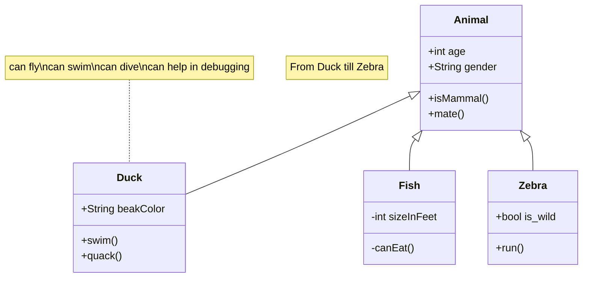

top
::: block

#### Header
_and_
Paragraph content
*in same block*

:::
bottom



note: gay?

---
```md
::: block

#### Header
_and_
Paragraph content
*in same block*

:::

---
```
# hi

> sdfs

```py
a = 3
if a:
   a = a ** 2

```

hi there
<!-- element class="red" -->
my name is,
`simon`

--

::: GOOD 
sdf
sd

::: a

---

sdf
- ds
- sdf
	- sdfsdf
		sdfsdfsdf

	s

*8sd*

**sdf**

| sdf | sdf |
| --- | --- |
| sd  | da  |
